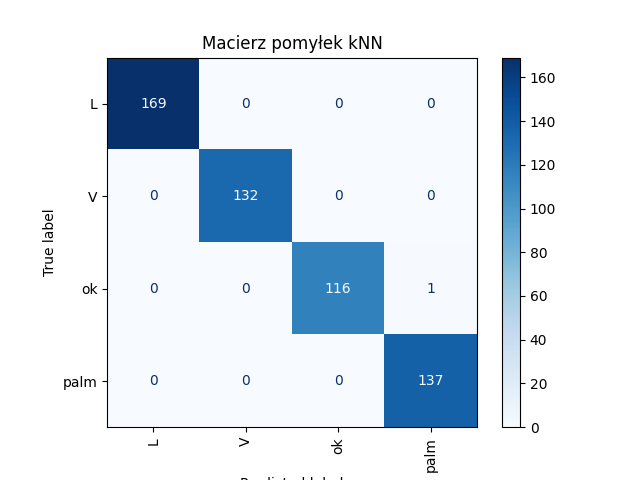
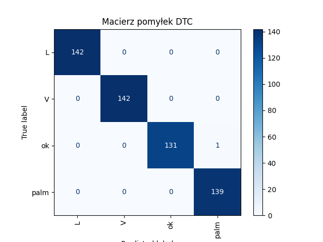
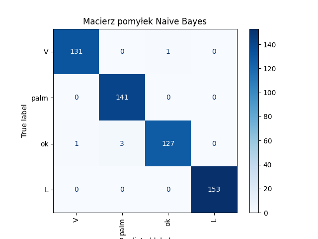
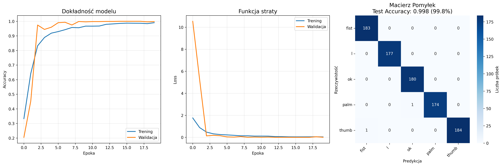
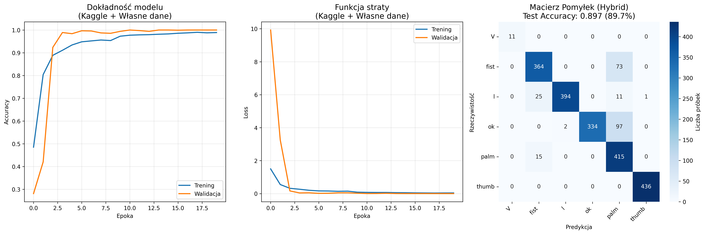
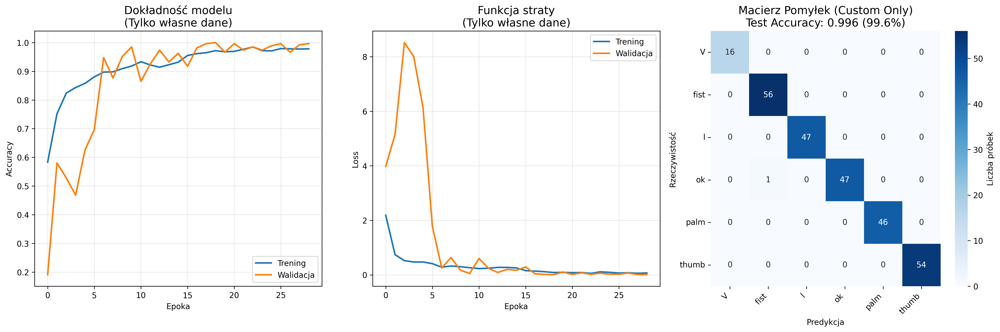
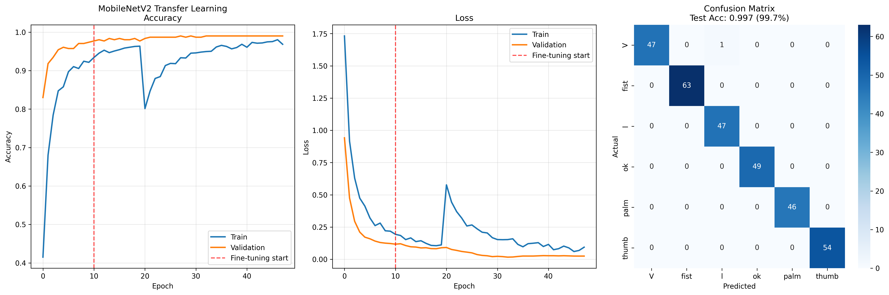
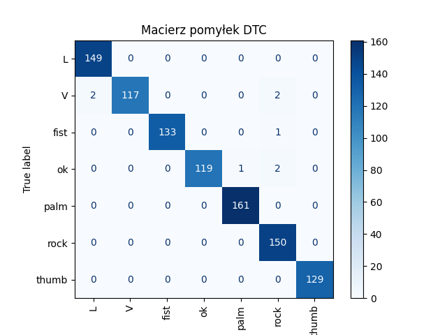
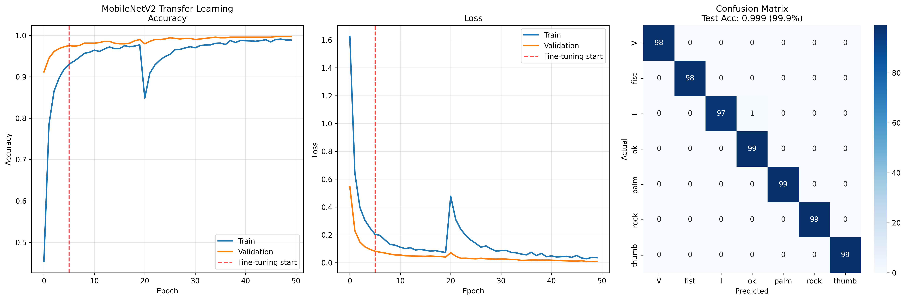
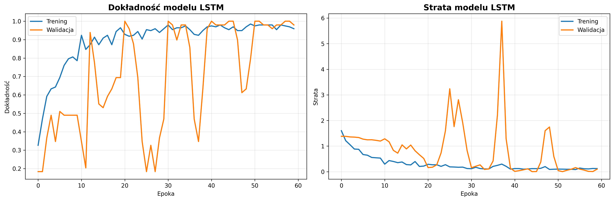

# „Sterowanie komputerem przy pomocy gestów dłoni w czasie rzeczywistym – porównanie klasyfikatorów ML i prototyp aplikacji użytkowej”

## Etap pierwszy - klasyfikacja danych liczbowych

Przygotowywanie własnych danych dla klasyfikatorów kNN, DTC, NB oraz MLP.
Wykorzystano paczkę media pipe i moduł Hands do ekstrakcji cech z obrazu (kod w pliku ./creating_data.py). Media pipe to biblioteka stworzona przez Google, która umożliwia łatwe wykrywanie i śledzenie różnych obiektów w obrazach i wideo w czasie rzeczywistym. Jeden zapisany gest to 21 punktów charakterystycznych (landmarks) ułożenia dłoni, każdy opisany współrzędnymi (x,y), co daje łącznie 42 cechy liczbowe i label danego gestu (plik ./data_sources/gestures.csv) .
Biblioteka mediapipe automatycznie normalizuje dane (współrzędne) do przedziału [0,1] względem rozmiaru obrazu.
W początkowym etapie zebrano 4 następujące gesty 
- `palm` - otwarta dłoń 
- `l` - gest "L" 
- `V` - znak 'peace'
- `ok` - znak OK


W datasecie każdy z gestów ma po ok. 450 danych.
Łączny rozmiar datasetu ~1800 próbek.

### Utworzenie prostego modelu k-Nearest Neighbours (kNN)

**Konfiguracja**
- Liczba sąsiadów = 5
- Metryka odległości: Euklidesowa 

**Wyniki ilościowe:**
- Test accuracy wynosi 99 %
- Przy sprawdzeniu metodą cross-validation accuracy wynosi 98%. Cross-validation pokazuje dobre wyniki we wszystkich foldach, bez dużych wahań: Wyniki cross-validation: [0.99326599 0.98989899 0.95608108 0.98648649 0.99662162]. Wskazuje to na brak przeuczenia a poprostu dobrą skuteczność modelu.
- Wyniki classification report:
```
              precision    recall  f1-score   support

           L       1.00      1.00      1.00       169
           V       1.00      1.00      1.00       132
          ok       1.00      0.99      1.00       117
        palm       0.99      1.00      1.00       137

    accuracy                           1.00       555
   macro avg       1.00      1.00      1.00       555
weighted avg       1.00      1.00      1.00       555
```
Tak wysoka dokładność wynika prawdopodobnie z czystości danych.
- W praktyce kNN radzi sobie na ogół dobrze z identyfikacją gestu, na 20 prób 18 gestów rozpoznał poprawnie. Zdaża mu się pomylić 'palm' z 'ok'.


### Utworzenie prostego modelu Decision Tree Classifier (DTC) 
- Model osiąga test accuracy 99%
- Wyniki cross-validation: [0.98058252 0.98701299 0.99675325 0.98376623 0.96103896]. Tu również bez wachań między foldami.
- Classification report:
```
              precision    recall  f1-score   support

           L       1.00      1.00      1.00       142
           V       1.00      1.00      1.00       142
          ok       1.00      0.99      1.00       132
        palm       0.99      1.00      1.00       139

    accuracy                           1.00       555
   macro avg       1.00      1.00      1.00       555
weighted avg       1.00      1.00      1.00       555
```
- W praktyce model jest praktycznie bezbłędny, na 20 testowych prób rozpoznał poprawnie wszystkie 4 gesty !!



### Utworzenie prostego modelu Naive Bayes

- Model osiąga accuracy 99%
- Wyniki cross-validation: [0.94609164 0.98113208 1.         0.88679245 0.96765499]. Tutaj widać, że fold 4 jest znacząco gorszy  - wskazuje to na niestabilność modelu i problemy z generalizacją. Tak duże wahania między foldami (11% rozstęp między 3 a 4) sugerują, że model silnie zależy od konkretnego podziału danych i może mieć trudności z konsystentnym rozpoznawaniem gestów na nowych, niewidzianych próbkach. Jest to czerwona flaga wskazująca na nieprzewidywalność modelu w praktycznym zastosowaniu.
Classification Report:
```
              precision    recall  f1-score   support

           L       1.00      1.00      1.00       153
           V       0.99      0.99      0.99       132
          ok       0.99      0.97      0.98       131
        palm       0.98      1.00      0.99       141

    accuracy                           0.99       557
   macro avg       0.99      0.99      0.99       557
weighted avg       0.99      0.99      0.99       557
```
- Praktyczny test wykazuje, że model jest o wiele słabszy od reszty klasyfikatorów, nie potrafi rozpoznać palm, z resztą gestów nie ma problemów, czasem myli 'V' z 'ok'. Rozpoznaje 13/20 gestów. Jak widać po macierzy pomyłek, klasyfikator popełnia najwięcej błędów ze wszystkich klasyfikatorów.


### Utworzenie sieci MLP 

**Architektura:**
- **Warstwa ukryta 1:** 100 neuronów + ReLU
- **Warstwa ukryta 2:** 50 neuronów + ReLU  
- **Warstwa wyjściowa:** 4 neurony + Softmax
- **Iteracje:** 500
- **Solver:** Adam

- Sieć neuronowa osiąga accuracy 99,8%
- Wyniki cross walidacji: [0.98058252 1.         0.99675325 1.         0.99675325], brak przeuczenia
- Wyniki classification report:
```
              precision    recall  f1-score   support

           L       1.00      1.00      1.00       142
           V       1.00      1.00      1.00       142
          ok       1.00      0.99      1.00       132
        palm       0.99      1.00      1.00       139

    accuracy                           1.00       555
   macro avg       1.00      1.00      1.00       555
weighted avg       1.00      1.00      1.00       555
```

- Przy 20 próbach model rozpoznaje 17/20 gestów, myli palm z V.


### Podsumowanie Etapu I

| Model | Test Acc. | CV Score | Praktyczny Test | Status |
|-------|-----------|----------|-----------------|--------|
| **DTC** | 99.0% | 98.2% ± 1.2% | **20/20**  |  **Najlepszy** |
| **MLP** | **99.8%** | 99.5% ± 0.8% | 17/20  | Bardzo dobry |
| **kNN** | 99.0% | 98.4% ± 1.4% | 18/20 | Dobry |
| **NB** | 99.0% | 95.6% ± 4.1% | 13/20 | Słaby praktycznie |

**Kluczowe wnioski:**
- **Wysoka czystość danych** - wszystkie modele osiągają >95% accuracy
- **Różnica teoria vs praktyka** - szczególnie widoczna u Naive Bayes
- **Decision Tree** - najlepsza kombinacja accuracy + praktycznej użyteczności
- **Cross-validation** potwierdza brak przeuczenia większości modeli


## Etap drugi - klasyfikacja zdjęć za pomocą własnej konwolucyjnej sieci neuronowej

Dane zebrano znów za pomocą biblioteki media pipe i modułu Hands, tym razem zapisywano zdjęcie wykrytej dłoni do wyznaczonego folderu (./dataset) (kod w pliku ./creating_photos.py)
Zdjęcia gestów pobierane są w rozdzielczości **64×64 pikseli** następującym procesem:

1. **Detekcja dłoni** - MediaPipe wyznacza landmarks
2. **Bounding box** - wyznaczenie prostokąta otaczającego dłoń + margines 20px
3. **Wycinanie** - ekstrakcja fragmentu obrazu z dłonią
4. **Resize** - normalizacja do 64×64x3 
5. **Zapis** - format JPG na dysku

Tutaj mamy następujące gesty: 'V', 'fist', 'palm', 'thumb', 'ok', 'l'  (6 klas)

**Preprocessing obrazów:**
- Resize do 64×64 pikseli 
- Konwersja BGR→RGB
- Normalizacja [0-255]→[0-1] 

**Preprocessing etykiet:**
- Mapowanie nazw gestów między datasetami
- Label encoding string→int dla CNN
(używam sparse_cathegorical_crossentropy, więc nie musze ohehot kodowac, to robi to samo?)

**Inteligentny podział danych:**
- Kaggle: podział po osobach nie po obrazkach
- Własne: stratified split
- Test generalizacji na nowych użytkownikach

**Data augmentation:**
- Rotacja: ±15°
- Przesunięcia: ±10%  
- Zoom: ±10%
- Zmiana jasności: 80-120%
- Brak horizontal_flip (nie wszystkie gesty sa symetryczne np. thumb)

**Użyte callbacki**
- EarlyStopping - monitorowanie val_loss, zatrzymanie po 7 epokach bez poprawy, przywrócenie najlepszych wag
- ReduceROnPlateu - monitorowanie val_loss, zmniejszenie learning_rate o połowę, redukcja przy 3 epokach bez poprawy
- PrintEpochMetrics() - custom callback, wyswietlanie metryk


Architektura sieci konwolucyjnej

| Warstwa              | Typ                  | Parametry                     | Wyjście (Output Shape) |
|----------------------|-----------------------|-------------------------------|-------------------------|
| 1                    | Conv2D               | 32 filtrów, 3×3, ReLU         | (64, 64, 32)            |
| 2                    | BatchNormalization   | -                             | (64, 64, 32)            |
| 3                    | MaxPooling2D         | 2×2                           | (32, 32, 32)            |
| 4                    | Dropout              | 0.25                          | (32, 32, 32)            |
| 5                    | Conv2D               | 64 filtrów, 3×3, ReLU         | (32, 32, 64)            |
| 6                    | BatchNormalization   | -                             | (32, 32, 64)            |
| 7                    | MaxPooling2D         | 2×2                           | (16, 16, 64)            |
| 8                    | Dropout              | 0.25                          | (16, 16, 64)            |
| 9                    | Conv2D               | 128 filtrów, 3×3, ReLU        | (16, 16, 128)           |
| 10                   | BatchNormalization   | -                             | (16, 16, 128)           |
| 11                   | MaxPooling2D         | 2×2                           | (8, 8, 128)             |
| 12                   | Dropout              | 0.4                           | (8, 8, 128)             |
| 13                   | Flatten              | -                             | (8192)                  |
| 14                   | Dense                | 256 neuronów, ReLU            | (256)                   |
| 15                   | Dropout              | 0.6                           | (256)                   |
| 16                   | Dense (Output)       | softmax, liczba klas = 6      | (6)                     |


     


### a) Użycie danych z kaggle - dataset z gestami dłoni i wytrenowanie na nim CNN
Rozmiar datasetu: 10 000 zdjęć (zostawiłam wybrane gesty, połowę typu "C" usunęłam)

Model bardzo szybko osiąga val accuracy ponad 90 % (już w 3/4 epoce). Są to bardzo niepokojące wyniki, można zobaczyć historię uczenia na wykresie, gdzie widać niepokojąco dobrą dokładność modelu już w początkowych epokach. Model w teorii nie powinien popełniać żadnych błędów, natomiast przy faktycznych testach z pomocą pliku ./tests/CNN_test.py model (cnn_kaggle_model.keras) radzi sobie tragicznie, na 20 gestów rozpoznał jedynie 2 poprawnie, prawie bezbłędnie rozpoznaje jedynie gest "palm", reszty gestów nie rozpoznaje/myli je. Model jest drastycznie przeuczony.


### b) Trenowanie modelu z połączonym dataset - gesty z kaggle oraz własne, stworzone za pomocą pliku creating_photos.py
Rozmiar datasetu: 10 000 zdjęc kaggle + 2042 własnych zdjęc

Tutaj również model bardzo szybko osiąga podejrzanie wysokie accuracy już w 3 epoce, macierz pomyłek wygląda lepiej (accuracy 89%), lecz w praktycznym teście model (cnn_hybrid_model.keras) radzi sobie porównywalnie źle jak poprzedni model, rozpoznaje jedynie gest palm, czasem ok i l, wogole nie rozpoznaje V, fist i thumb.


### c) Wytrenowanie modelu jedynie na własnych danych  
Rozmiar datasetu: 2042 własnych zdjęć (./dataset/), ten dataset jest o wiele mniejszy, gesty pozostają takie same

Tutaj widać proces uczenia się nie był tak idealny jak w etapach a i b, ale wciąż loss staje się minimalnie niski już po 5 epoce, sugeruje to przeuczenie, macierz pomyłek z pozoru wygląda bardzo dobrze, accuracy 98%
Praktyczny test wykazuje jednak, że model radzi sobie w 10/20 gestów testowych, rozpoznaje thumb, palm, l oraz ok, natomiast V i fist nie jest w stanie rozpoznać wogole.


Wnioski - zestaw zdjęc z datasetu kaggle jest słaby, model uczony na nim zachowuje się jakby występował leakage (być może zdjęcia są zbyt podobne do siebie). Najlepiej radzi sobie model trenowany na własnych danych, jednakże niestety wciąż widoczne jest przeuczenie.


## Etap trzeci - transfer learning

**Czym jest MobileNetV2**

MobileNetV2 to wydajna architektura konwolucyjnych sieci neuronowych zaprojektowana z myślą o zastosowaniach mobilnych i urządzeniach o ograniczonych zasobach obliczeniowych. Została wprowadzona przez Google w 2018 roku i jest następcą MobileNetV1.
Główne cechy MobileNetV2 to:
- Inverted Residuals – tzw. „odwrócone reszdualne bloki”, które rozszerzają wymiary kanałów wejściowych przed zastosowaniem filtrów splotowych o małym rozmiarze (depthwise separable convolutions), a następnie redukują je z powrotem,
- Linear Bottlenecks – warstwy przejściowe z liniową aktywacją, które pomagają zachować istotne informacje i minimalizować utratę sygnału,
- Niska złożoność obliczeniowa i mniejsza liczba parametrów w porównaniu do tradycyjnych CNN o podobnej dokładności.
Implementacja: https://keras.io/api/applications/mobilenet/#mobilenetv2-function

Transfer learning - douczenie gotowego modelu MobileNetV2 z biblioteki keras na własnych danych - czyli na 6 gestach V, fist, palm, thumb, ok, l 
Usunięcie decyzyjnej części klasyfikatora i uczysz własny.

Dwufazowe podejście do trenowania:
- **Faza 1**: Feature extraction - zamrożone warstwy bazowe MobileNetV2, trenowanie tylko klasyfikatora przez 20 epok
- **Faza 2**: Fine-tuning - odmrożenie ostatnich 50 warstw i douczanie z bardzo niskim learning rate (0.00001) przez 30 epok

Architektura Klasyfikatora:
| Warstwa                       | Typ                     | Parametry                              | Wyjście (Output Shape) |
|-------------------------------|--------------------------|------------------------------------------|-------------------------|
| 1                             | MobileNetV2 (bazowa)     | pretrained, zamrożona (częściowo)        | (7, 7, 1280)            |
| 2                             | GlobalAveragePooling2D   | -                                        | (1280)                  |
| 3                             | BatchNormalization       | -                                        | (1280)                  |
| 4                             | Dense                    | 256 neuronów, ReLU                       | (256)                   |
| 5                             | Dropout                  | 0.5 lub 0.6                              | (256)                   |
| 6                             | Dense                    | 128 neuronów, ReLU                       | (128)                   |
| 7                             | Dropout                  | 0.5 lub 0.6                              | (128)                   |
| 8                             | Dense (Output)           | 6 neuronów, softmax (6 klas)             | (6)                     |

Dane przetwarzane do rozmiaru 224×224 (wymagany przez MobileNetV2).
Augmentacja danych w fazie trenowania:
- Rotacja: ±15°
- Przesunięcia: ±10%  
- Zoom: ±10%
- Zmiana jasności: 80-120%
- Brak horizontal_flip (nie wszystkie gesty są symetryczne np. thumb)

Jak widac na wykresie model w naturalny sposób osiąga wysokie accuracy i niski loss, brak widocznego przeuczenia. Na macierzy pomyłek widać, że test accuracy jest prawie całkowita. Test praktyczny daje wyniki gorsze niż oczekiwane ale lepsze niż własny CNN, model wykrywa 15/20 gestów poprawnie, największy problem ma z gestem ok.

Skok widoczny na wykresie wynika ze zminy faz treningu w 20 epoce:
Model nagle "traci" część umiejętności, nowe warstwy zaczynają się uczyć od nowa. Validation accuracy spada z ~98% do ~80%.
Po kilku epokach model odzyskuje stabilizację, warstwy muszą się poprostu "dostroić"


## Etap czwarty - powiększanie własnego datasetu i doszkalanie najlepszych klasyfikatorów

Wybrano po jednym klasyfikatorze z dwóch etapów, które najlepiej zdały test praktyczny 

Etap I - Decision Tree Classifier 

Etap III - MobileNetV2

Do datasetu landmarks gestów ./data_sources/gestures.csv dodano 3 nowe gesty: 'thumb', 'fist', 'rock', każdy liczący po ok. 450 zebranych danych, tak jak reszta poprzednich gestów.
Dataset zdjęć ./dataset/ powiększono z 400 zdjęć na każdy gest do 650 zdjęć oraz dodano nowy gest 'rock' liczący również 650 zdjęć.


#### Decision Tree Classifier
 - Accuracy: 0.9917184265010351
- Cross-validation scores: [0.97670807 0.96583851 0.99688958 0.98911353 0.93623639]
Classification Report:
```
              precision    recall  f1-score   support

           L       0.99      1.00      0.99       149
           V       1.00      0.97      0.98       121
        fist       1.00      0.99      1.00       134
          ok       1.00      0.98      0.99       122
        palm       0.99      1.00      1.00       161
        rock       0.97      1.00      0.98       150
       thumb       1.00      1.00      1.00       129

    accuracy                           0.99       966
   macro avg       0.99      0.99      0.99       966
weighted avg       0.99      0.99      0.99       966
```
W teście praktycznym klasyfikator radzi sobie doskonale, na 20 prób wykrywa wszystkie gesty poprawnie, jedyna drobna uwaga to czasem ma problem z 'palm' i klasyfikuje ten gest jako 'ok', po poruszeniu/przybliżeniu ręki jednak klasyfikator identyfikuje gest dobrze.




#### MobileNetV2

Wczytano 4599 obrazów
Podział: Train=3219, Val=690, Test=690
Klasy: ['V' 'fist' 'l' 'ok' 'palm' 'rock' 'thumb']


FAZA 1: Feature extraction (zamrożone warstwy)
```
.
.
Epoch 20/20
202/202 ━━━━━━━━━━━━━━━━━━━━ 73s 349ms/step - accuracy: 0.9741 - loss: 0.0711 - val_accuracy: 0.9913 - val_loss: 0.0299 - learning_rate: 1.0000e-04
```

FAZA 2: Fine-tuning (odmrożone ostatnie warstwy)
```
.
.
Epoch 30/30
403/403 ━━━━━━━━━━━━━━━━━━━━ 68s 168ms/step - accuracy: 0.9902 - loss: 0.0313 - val_accuracy: 0.9986 - val_loss: 0.0086 - learning_rate: 1.0000e-05
```

Test Accuracy: 0.9986 (99.86%)

Classification report:
```
              precision    recall  f1-score   support

           V     1.0000    1.0000    1.0000        98
        fist     1.0000    1.0000    1.0000        98
           l     1.0000    0.9898    0.9949        98
          ok     0.9900    1.0000    0.9950        99
        palm     1.0000    1.0000    1.0000        99
        rock     1.0000    1.0000    1.0000        99
       thumb     1.0000    1.0000    1.0000        99

    accuracy                         0.9986       690
   macro avg     0.9986    0.9985    0.9985       690
weighted avg     0.9986    0.9986    0.9986       690
```
- Test praktyczny wykazuje umiarkowaną skuteczność modelu, bezbłędnie wykrywa gest fist (z którym był spory problem w innych modelach), l, ok oraz thumb inne gesty zdaża mu się mylić. Największy problem ma z gestem V.




### Ensemble - łączenie najlepszych modeli

Implementacja w pliku ./tests/Ensemble_test.py

**Definicja Ensemble Learning:**
Ensemble learning to technika łączenia predykcji z wielu różnych modeli w celu uzyskania lepszej dokładności i stabilności niż pojedynczy klasyfikator. Główne założenia to wykorzystanie **różnorodności modeli** (diversity) i **mądrości tłumu** (wisdom of crowds) - błędy pojedynczych modeli się kompensują.

**Wybór modeli do Ensemble:**
Na podstawie wyników z poprzednich etapów wybrano **dwa najlepsze modele** o **komplementarnych mocnych stronach**:

1. **Decision Tree Classifier (DTC)**:
   - **Perfekcyjny praktyczny test:** 20/20 gestów
   - **Najszybszy:** 0.214ms inference time
   - **Dane wejściowe:** 42 cechy landmarks (x,y współrzędne)
   - **Mocna strona:** Precyzyjne rozpoznawanie na podstawie geometrii dłoni

2. **MobileNetV2**:
   - **Najwyższa test accuracy:** 99.86%
   - **Głębokie features:** Analiza tekstur, kształtów, kontekstu obrazu
   - **Dane wejściowe:** Obraz 224×224×3 pikseli
   - **Mocna strona:** Rozpoznawanie złożonych wzorców wizualnych

**Strategia łączenia (Voting Strategy):**

```python
def predict_ensemble(self, hand_landmarks, image):
    dtc_pred = self.predict_dtc(hand_landmarks)         
    mobilenet_result = self.predict_mobilenet(image)  

    if dtc_pred == mobilenet_result['prediction']:
        return {'prediction': dtc_pred, 'confidence': 0.95, 'consensus': 'AGREEMENT'}

    elif mobilenet_result['confidence'] > 0.8:
        return {'prediction': mobilenet_result['prediction'], 
                'confidence': mobilenet_result['confidence'], 
                'consensus': 'MOBILENET_CONFIDENT'}

    else:
        return {'prediction': dtc_pred, 'confidence': 0.7, 'consensus': 'DTC_FALLBACK'}
```

**Multi-modal Input Processing:**

| Model | Dane wejściowe | Preprocessing | Czas inferencji |
|-------|----------------|---------------|-----------------|
| **DTC** | 42 landmarks | MediaPipe (x,y) → [x₀...x₂₀,y₀...y₂₀] | ~0.2ms |
| **MobileNet** | RGB obraz | BGR→RGB, resize 224×224, preprocess_input | ~136ms |
| **Ensemble** | **Oba** | Równoległa predykcja + voting | ~136ms |

**Zalety Ensemble:**
- **Wyższa stabilność** - błędy modeli się kompensują
- **Redundancja** - jeśli jeden model zawiedzie, drugi przejmuje
- **Multi-modal analysis** - geometria landmarks + visual features
- **Confidence scoring** - ensemble może ocenić pewność predykcji


**Implementacja (plik: `./tests/Ensemble_test.py`):**
- **Real-time processing** z kamerą
- **Równoległa predykcja** obu modeli
- **Voting strategy** z confidence thresholding
- **Visual feedback** - pokazuje votes i consensus method

**Wnioski:**
Ensemble łączy **szybkość i precyzję DTC** z **głęboką analizą MobileNet**, osiągając lepszą stabilność niż pojedyncze modele. **Multi-modal approach** (landmarks + pixels) daje bardziej robustne rozpoznawanie gestów w różnych warunkach oświetlenia i pozycjach dłoni.

**Test**
W założeniu powinno działać, jednak w praktyce model łączony spisuje się słabo, rozpoznaje 12/20 gestów, ręką trzeba kręcić i trzymać blisko kamery.


## Porównanie modeli


| Model | Test Accuracy (%) | Inference Time (ms) | Memory Usage (MB) | Praktyczny Test |
|-------|-------------------|---------------------|-------------------|-----------------|
| DTC | 99.2 | 0.214 ± 0.066 | 1.24 | 20/20 ✓✓✓ |
| MLP | 99.8 | 0.174 ± 0.070 | 0.16 | 17/20 ✓ |
| Naive Bayes | 97.8 | 0.355 ± 0.138 | 0.07 | 13/20 |
| kNN | 99.0 | 35.233 ± 2.080 | 78.8 | 18/20 ✓ |
| CNN | 99.6 | 107.661 ± 14.883 | 47.28 | 10/20 ✓✓ |
| LSTM | 98.4 | 108.900 ± 17.311 | 4.04 | Overfitted |
| MobileNetV2 | 99.9 | 135.774 ± 14.854 | 51.83 | 15/20 ✓ |

Ranking pod względem: 
**Szybkość**
- MLP: 0.174ms - najszybszy
- DTC: 0.214ms - bardzo blisko
- Naive Bayes: 0.355ms 

**Pamięć**
- Naive Bayes: 0.07MB - super lekki
- MLP: 0.16MB
- DTC: 1.24MB

**Dokładność**
- MobileNetV2: 99.9% - najwyższa
- MLP: 99.8%
- CNN: 99.6%

I najważniejsza kategoria czyli:
**Praktyczne użycie**
- DTC: 20/20 - perfekcyjny
- kNN: 18/20 - bardzo dobry
- MLP 17/20 


## Etap piąty

Wdrażanie funkcjonalności aplikacji sterującej komputerem

Plik ./app/main.py to podstawowa implementacja sterowania komputerem za pomocą gestów. Przy włączeniu programu można wybrać jeden z 3 możliwych modeli - DTC, MobileNetV2 oraz Ensemble model.
Gesty mają przypisaną daną akcję która jest wykonywana za pomocą biblioteki pyautogui.

Prototyp aplikacji weryfikacyjnej - plik ./app/safety_code.py, użytkownik musi podać poprawną sekwencję 5 gestów. Użyto DTC


## Część eksperymentalna

### LSTM - Rozpoznawanie gestów dynamicznych


Implementacja rozpoznawania gestów dynamicznych poprzez uczenie modelu Long Short-Term Memory.
Zapisywanie sekwencji odbywa się za pomocą pliku `./creating_sequence_data.py`, dane są zapisywane do pliku `./data_sources/sequences.csv`.

Poprzednie modele (kNN, DTC, NB, MLP, CNN, MobileNetV2) analizowały **statyczne gesty** - pojedyncze klatki lub obrazy. 
LSTM pozwala na rozpoznawanie **gestów dynamicznych** - sekwencji ruchu w czasie, takich jak:
- Ruch palca w górę/w dół
- Zoom in/out (rozchylanie/ściskanie palców)
- Machanie, obracanie dłoni


**Format danych:**
- Każda sekwencja = 10 kolejnych klatek (timesteps)
- Każda klatka = 21 punktów × 2 współrzędne (x,y) = 42 cechy na klatkę
- **Input shape:** `(n_samples, 10, 42)`
- **Zebrano łącznie:** 307 sekwencji gestów dynamicznych

**Gesty dynamiczne (po ~77 próbek każdy):**
1. `finger_up` - ruch palca w górę
2. `finger_down` - ruch palca w dół  
3. `zoom_in` - rozchylanie palców (zoom)
4. `zoom_out` - ściskanie palców


**3-warstwowa sieć LSTM** z normalizacją i regularyzacją:

```python
Sequential([
    LSTM(128, return_sequences=True, input_shape=(10, 42)),
    BatchNormalization(),
    Dropout(0.3),
    
    LSTM(64, return_sequences=True),
    BatchNormalization(), 
    Dropout(0.3),
    
    LSTM(32, return_sequences=False),
    BatchNormalization(),
    Dropout(0.4),
    
    Dense(64, activation='relu'),
    Dropout(0.5),
    Dense(32, activation='relu'),
    Dropout(0.3),
    Dense(4, activation='softmax') 
])
```


**Preprocessing sekwencji:**
- **Sliding window:** 10 kolejnych klatek landmarks
- **Reshape:** `(307, 420)` → `(307, 10, 42)` 
- **Normalizacja:** MediaPipe automatycznie normalizuje współrzędne do [0,1]
- **Label encoding:** String → categorical (one-hot)

**Konfiguracja treningu:**
- **Podział danych:** Train/Val/Test = 60%/20%/20%
- **Stratified split** dla równomiernego rozkładu klas
- **Maksymalne epoki:** 100
- **Callbacks:**
  - `EarlyStopping(patience=15)` - zapobiega przeuczeniu
  - `ReduceLROnPlateau(factor=0.5, patience=8)` - adaptacyjny learning rate

#### Wyniki

**Finalne metryki:**
- **Test Accuracy:** 98.39%
- **Precision (macro avg):** 0.99
- **Recall (macro avg):** 0.98  
- **F1-score (macro avg):** 0.98

**Classification Report:**
```
              precision    recall  f1-score   support

 finger_down       1.00      1.00      1.00        15
   finger_up       1.00      1.00      1.00        15
     zoom_in       1.00      0.94      0.97        16
    zoom_out       0.94      1.00      0.97        16

    accuracy                           0.98        62
   macro avg       0.99      0.98      0.98        62
weighted avg       0.98      0.98      0.98        62
```

**Confusion Matrix:**
```
              finger_down  finger_up  zoom_in  zoom_out
finger_down        15         0        0        0
finger_up           0        15        0        0  
zoom_in             0         0       15        1
zoom_out            0         0        0       16
```

Wyniki wyglądają doskonale jednak już spoglądająć na poniższy wykres widać poważne problemy z modelem. Trening jest niestabilny, mamy tu overfitting, zapamiętał dane treningowe i nie potrafi sklasyfikować danych walidacyjnych(chaotyczne validation), 
W praktyce model wszystkie pokazane gesty wykrywa jako 'finger_up' z pewnością 100%, także wyniki są conajmnije słabe.

Prawdopodobnie wynika to z małego zbioru danych, co wymaga poprawki.


