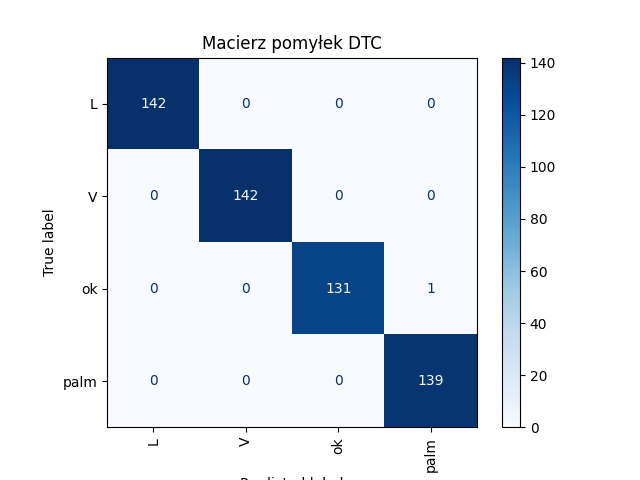
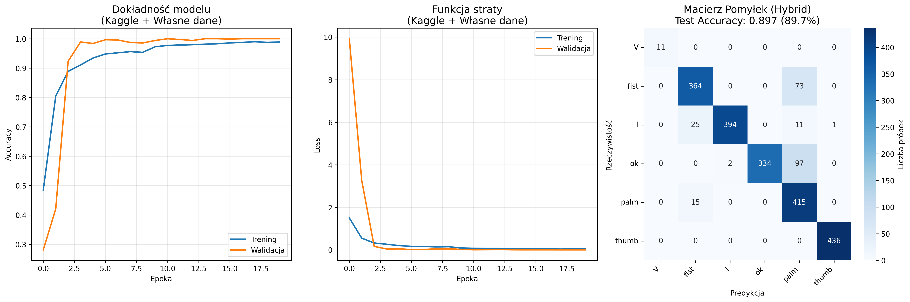
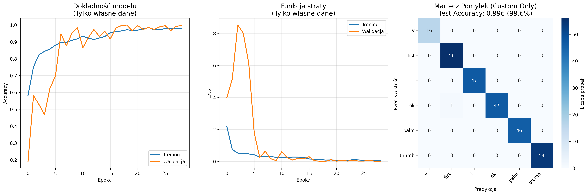
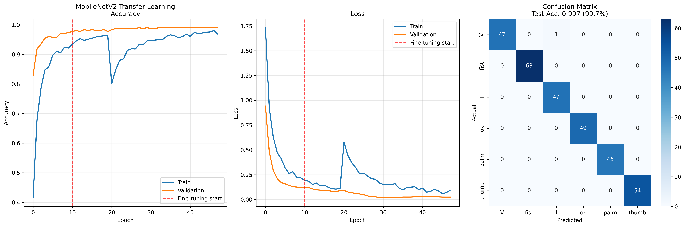
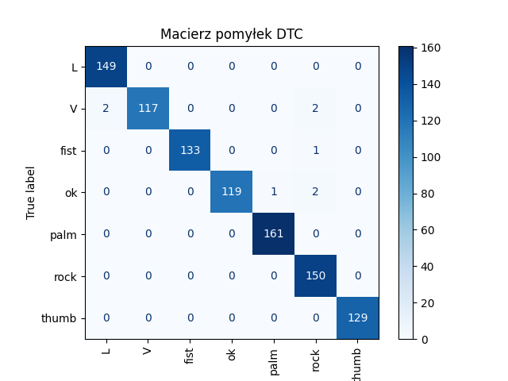

# „Sterowanie komputerem przy pomocy gestów dłoni w czasie rzeczywistym – porównanie klasyfikatorów ML i prototyp aplikacji użytkowej”

## Etap pierwszy - klasyfikacja danych liczbowych

Przygotowywanie własnych danych dla klasyfikatorów kNN, DTC oraz MLP.
Wykorzystano paczkę media pipe i moduł Hands do ekstrakcji cech z obrazu (kod w pliku ./creating_data.py) - jeden zapisany gest to 21 współrzędnych ułożenia dłoni i label danego gestu (plik ./data_sources/gestures.csv) 
Biblioteka mediapipe automatycznie normalizuje dane (współrzędne) do przedziału [0,1]
Zebrano 4 następujące gesty - 'palm', 'l','V' oraz 'ok'
W datasecie każdy z gestów ma po ok. 450 danych.

### Utworzenie prostego modelu kNN 

Liczba sąsiadów = 5

- Accuracy wynosi 99 %
- Przy sprawdzeniu metodą cross-validation accuracy wynosi 98%. Cross-validation pokazuje dobre wyniki we wszystkich foldach, bez dużych wahań: Wyniki cross-validation: [0.99326599 0.98989899 0.95608108 0.98648649 0.99662162]. Wskazuje to na brak przeuczenia a poprostu dobrą skuteczność modelu.
- Wyniki classification report:
Classification Report:
              precision    recall  f1-score   support

           L       1.00      1.00      1.00       169
           V       1.00      1.00      1.00       132
          ok       1.00      0.99      1.00       117
        palm       0.99      1.00      1.00       137

    accuracy                           1.00       555
   macro avg       1.00      1.00      1.00       555
weighted avg       1.00      1.00      1.00       555

Tak wysoka dokładność może wynikać z czystości danych. 
- W praktyce kNN radzi sobie na ogół dobrze z identyfikacją gestu, na 20 prób 18 gestów rozpoznał poprawnie. Zdaża mu się pomylić 'palm' z 'ok'.

### Utworzenie prostego modelu DTC 
- Model osiąga accuracy 99%
- Wyniki cross-validation: [0.98058252 0.98701299 0.99675325 0.98376623 0.96103896]. Tu również bez wachań między foldami.
- Classification report:
Classification Report:
              precision    recall  f1-score   support

           L       1.00      1.00      1.00       142
           V       1.00      1.00      1.00       142
          ok       1.00      0.99      1.00       132
        palm       0.99      1.00      1.00       139

    accuracy                           1.00       555
   macro avg       1.00      1.00      1.00       555
weighted avg       1.00      1.00      1.00       555

- W praktyce model jest prawie bezbłędny, na 20 testowych prób rozpoznał poprawnie wszystkie 4 gesty.

### Utworzenie sieci MLP 

2 warstwy ukryte, jedna 100 druga 50 neuronów, 500 iteracji

- Sieć neuronowa osiąga accuracy 99,8%
- Wyniki cross walidacji: [0.98058252 1.         0.99675325 1.         0.99675325], brak przeuczenia
- Wyniki classification report:
Classification Report:
              precision    recall  f1-score   support

           L       1.00      1.00      1.00       142
           V       1.00      1.00      1.00       142
          ok       1.00      0.99      1.00       132
        palm       0.99      1.00      1.00       139

    accuracy                           1.00       555
   macro avg       1.00      1.00      1.00       555
weighted avg       1.00      1.00      1.00       555

- Przy 20 próbach model rozpoznaje 17/20 gestów, myli palm z V.

## Etap drugi - klasyfikacja zdjęć za pomocą własnej konwolucyjnej sieci neuronowej

Dane zebrano znów za pomocą paczki media pipe i modułu Hands, tym razem zapisywano zdjęcie wykrytej dłoni do wyznaczonego folderu (./dataset) (kod w pliku ./creating_photos.py)
Zdjęcia gestów pobierane są w rozdzielczości **64×64 pikseli** następującym procesem:

1. **Detekcja dłoni** - MediaPipe wyznacza landmarks
2. **Bounding box** - wyznaczenie prostokąta otaczającego dłoń + margines 20px
3. **Wycinanie** - ekstrakcja fragmentu obrazu z dłonią
4. **Resize** - normalizacja do 64×64x3 
5. **Zapis** - format JPG na dysku

Tutaj mamy następujące gesty: 'V', 'fist', 'palm', 'thumb', 'ok', 'l' 

**Preprocessing obrazów:**
- Resize do 64×64 pikseli 
- Konwersja BGR→RGB
- Normalizacja [0-255]→[0-1] 

**Preprocessing etykiet:**
- Mapowanie nazw gestów między datasetami
- Label encoding string→int dla CNN
(używam sparse_cathegorical_crossentropy, więc nie musze ohehot kodowac, to robi to samo?)

**Inteligentny podział danych:**
- Kaggle: podział po osobach nie po obrazkach
- Własne: stratified split
- Test generalizacji na nowych użytkownikach

**Data augmentation:**
- Rotacja: ±15°
- Przesunięcia: ±10%  
- Zoom: ±10%
- Zmiana jasności: 80-120%
- Brak horizontal_flip (nie wszystkie gesty sa symetryczne np. thumb)

Architektura sieci konwolucyjnej

| Warstwa              | Typ                  | Parametry                     | Wyjście (Output Shape) |
|----------------------|-----------------------|-------------------------------|-------------------------|
| 1                    | Conv2D               | 32 filtrów, 3×3, ReLU         | (64, 64, 32)            |
| 2                    | BatchNormalization   | -                             | (64, 64, 32)            |
| 3                    | MaxPooling2D         | 2×2                           | (32, 32, 32)            |
| 4                    | Dropout              | 0.25                          | (32, 32, 32)            |
| 5                    | Conv2D               | 64 filtrów, 3×3, ReLU         | (32, 32, 64)            |
| 6                    | BatchNormalization   | -                             | (32, 32, 64)            |
| 7                    | MaxPooling2D         | 2×2                           | (16, 16, 64)            |
| 8                    | Dropout              | 0.25                          | (16, 16, 64)            |
| 9                    | Conv2D               | 128 filtrów, 3×3, ReLU        | (16, 16, 128)           |
| 10                   | BatchNormalization   | -                             | (16, 16, 128)           |
| 11                   | MaxPooling2D         | 2×2                           | (8, 8, 128)             |
| 12                   | Dropout              | 0.4                           | (8, 8, 128)             |
| 13                   | Flatten              | -                             | (8192)                  |
| 14                   | Dense                | 256 neuronów, ReLU            | (256)                   |
| 15                   | Dropout              | 0.6                           | (256)                   |
| 16                   | Dense (Output)       | softmax, liczba klas = 6      | (6)                     |

     callbacks = [
        EarlyStopping(monitor='val_loss', patience=7, restore_best_weights=True),
        ReduceLROnPlateau(monitor='val_loss', factor=0.5, patience=3, min_lr=1e-6),
        PrintEpochMetrics()
    ]

### a) Użycie danych z kaggle - dataset z gestami dłoni i wytrenowanie na nim CNN
Rozmiar datasetu: 10 000 zdjęć (zostawiłam wybrane gesty, połowę typu "C" usunęłam)

Model bardzo szybko osiąga val accuracy ponad 90 % (już w 3/4 epoce). Są to bardzo niepokojące wyniki, można zobaczyć historię uczenia na wykresie, gdzie widać niepokojąco dobrą dokładność modelu już w początkowych epokach. Model w teorii nie powinien popełniać żadnych błędów, natomiast przy faktycznych testach z pomocą pliku ./tests/CNN_test.py model (cnn_kaggle_model.keras) radzi sobie tragicznie, na 20 gestów rozpoznał jedynie 2 poprawnie, prawie bezbłędnie rozpoznaje jedynie gest "palm", reszty gestów nie rozpoznaje/myli je.

### b) Trenowanie modelu z połączonym dataset - gesty z kaggle oraz własne, stworzone za pomocą pliku creating_photos.py
Rozmiar datasetu: 10 000 zdjęc kaggle + 2042 własnych zdjęc

Tutaj również model bardzo szybko osiąga podejrzanie wysokie accuracy już w 3 epoce, macierz pomyłek wygląda lepiej (accuracy 89%), lecz w praktycznym teście model (cnn_hybrid_model.keras) radzi sobie porównywalnie źle jak poprzedni model, rozpoznaje jedynie gest palm, czasem ok i l, wogole nie rozpoznaje V, fist i thumb.

### c) Wytrenowanie modelu jedynie na własnych danych  
Rozmiar datasetu: 2042 własnych zdjęć (./dataset/), ten dataset jest o wiele mniejszy, gesty pozostają takie same

Tutaj widać proces uczenia się nie był tak idealny jak w etapach a i b, ale wciąż loss staje się minimalnie niski już po 5 epoce, macierz pomyłek z pozoru wygląda bardzo dobrze, accuracy 98%
Praktyczny test wykazuje jednak, że model radzi sobie w 10/20 gestów testowych, rozpoznaje thumb, palm, l oraz ok, natomiast V i fist nie jest w stanie rozpoznać wogole.

Wnioski - zestaw zdjęc z datasetu kaggle jest słaby, model uczony na nim zachowuje się jakby występował leakage (być może zdjęcia są zbyt podobne do siebie). Najlepiej radzi sobie model trenowany na własnych danych, jednakże niestety wciąż widoczne jest przeuczenie.

## Etap trzeci - transfer learning
ZROB ANALOGICZNY OPIS TEGO PREPROCESSINGU

Transfer learning - douczenie gotowego modelu MobileNetV2 z biblioteki keras na własnych danych - czyli na 6 gestach V, fist, palm, thumb, ok, l 

Dwufazowe podejście do trenowania:
- **Faza 1**: Feature extraction - zamrożone warstwy bazowe MobileNetV2, trenowanie tylko klasyfikatora
- **Faza 2**: Fine-tuning - odmrożenie ostatnich 50 warstw i douczanie z bardzo niskim learning rate (0.00001)

Architektura Klasyfikatora:
| Warstwa                       | Typ                     | Parametry                              | Wyjście (Output Shape) |
|-------------------------------|--------------------------|------------------------------------------|-------------------------|
| 1                             | MobileNetV2 (bazowa)     | pretrained, zamrożona (częściowo)        | (7, 7, 1280)            |
| 2                             | GlobalAveragePooling2D   | -                                        | (1280)                  |
| 3                             | BatchNormalization       | -                                        | (1280)                  |
| 4                             | Dense                    | 256 neuronów, ReLU                       | (256)                   |
| 5                             | Dropout                  | 0.5 lub 0.6                              | (256)                   |
| 6                             | Dense                    | 128 neuronów, ReLU                       | (128)                   |
| 7                             | Dropout                  | 0.5 lub 0.6                              | (128)                   |
| 8                             | Dense (Output)           | 6 neuronów, softmax (6 klas)             | (6)                     |

Dane przetwarzane do rozmiaru 224×224 (wymagany przez MobileNetV2).
Augmentacja danych w fazie trenowania:
- Rotacja: ±15°
- Przesunięcia: ±10%  
- Zoom: ±10%
- Zmiana jasności: 80-120%
- Brak horizontal_flip (nie wszystkie gesty są symetryczne np. thumb)

Jak widac na wykresie model w naturalny sposób osiąga wysokie accuracy i niski loss, brak widocznego przeuczenia. Na macierzy pomyłek widać, że test accuracy jest prawie całkowita. Test praktyczny daje wyniki gorsze niż oczekiwane ale lepsze niż własny CNN, model wykrywa 15/20 gestów poprawnie, największy problem ma z gestem ok.

## Etap czwarty - powiększanie własnego datasetu i doszkalanie najlepszych klasyfikatorów 

Wybrano po jednym klasyfikatorze z dwóch etapów, które najlepiej zdały test praktyczny 
Etap I - Decision Tree Classifier 
Etap III - MobileNetV2

Do datasetu współrzędnych gestów ./data_sources/gestures.csv dodano 3 nowe gesty: 'thumb', 'fist', 'rock', każdy liczący po ok 450 zebranych danych, tak jak reszta poprzednich gestów.
Dataset zdjęć ./dataset/ powiększono z 400 zdjęć na każdy gest do 650 zdjęć oraz dodano nowy gest 'rock' liczący również 650 zdjęć.

Decision Tree Classifier
Accuracy: 0.9917184265010351
Cross-validation scores: [0.97670807 0.96583851 0.99688958 0.98911353 0.93623639]
Classification Report:
              precision    recall  f1-score   support

           L       0.99      1.00      0.99       149
           V       1.00      0.97      0.98       121
        fist       1.00      0.99      1.00       134
          ok       1.00      0.98      0.99       122
        palm       0.99      1.00      1.00       161
        rock       0.97      1.00      0.98       150
       thumb       1.00      1.00      1.00       129

    accuracy                           0.99       966
   macro avg       0.99      0.99      0.99       966
weighted avg       0.99      0.99      0.99       966

W teście praktycznym klasyfikator radzi sobie doskonale, na 20 prób wykrywa wszystkie gesty poprawnie, jedyna drobna uwaga to czasem ma problem z 'palm' i z niewiadomego powodu klasyfikuje to jako 'ok', po poruszeniu/przybliżeniu ręki jednak klasyfikator identyfikuje gest dobrze.

lstm
📋 Architektura modelu:
Model: "sequential"
┏━━━━━━━━━━━━━━━━━━━━━━━━━━━━━━━━━━━━━━┳━━━━━━━━━━━━━━━━━━━━━━━━━━━━━┳━━━━━━━━━━━━━━━━━┓
┃ Layer (type)                         ┃ Output Shape                ┃         Param # ┃
┡━━━━━━━━━━━━━━━━━━━━━━━━━━━━━━━━━━━━━━╇━━━━━━━━━━━━━━━━━━━━━━━━━━━━━╇━━━━━━━━━━━━━━━━━┩
│ lstm_1 (LSTM)                        │ (None, 10, 128)             │          87,552 │
├──────────────────────────────────────┼─────────────────────────────┼─────────────────┤
│ batch_normalization                  │ (None, 10, 128)             │             512 │
│ (BatchNormalization)                 │                             │                 │
├──────────────────────────────────────┼─────────────────────────────┼─────────────────┤
│ dropout (Dropout)                    │ (None, 10, 128)             │               0 │
├──────────────────────────────────────┼─────────────────────────────┼─────────────────┤
│ lstm_2 (LSTM)                        │ (None, 10, 64)              │          49,408 │
├──────────────────────────────────────┼─────────────────────────────┼─────────────────┤
│ batch_normalization_1                │ (None, 10, 64)              │             256 │
│ (BatchNormalization)                 │                             │                 │
├──────────────────────────────────────┼─────────────────────────────┼─────────────────┤
│ dropout_1 (Dropout)                  │ (None, 10, 64)              │               0 │
├──────────────────────────────────────┼─────────────────────────────┼─────────────────┤
│ lstm_3 (LSTM)                        │ (None, 32)                  │          12,416 │
├──────────────────────────────────────┼─────────────────────────────┼─────────────────┤
│ batch_normalization_2                │ (None, 32)                  │             128 │
│ (BatchNormalization)                 │                             │                 │
├──────────────────────────────────────┼─────────────────────────────┼─────────────────┤
│ dropout_2 (Dropout)                  │ (None, 32)                  │               0 │
├──────────────────────────────────────┼─────────────────────────────┼─────────────────┤
│ dense_1 (Dense)                      │ (None, 64)                  │           2,112 │
├──────────────────────────────────────┼─────────────────────────────┼─────────────────┤
│ dropout_3 (Dropout)                  │ (None, 64)                  │               0 │
├──────────────────────────────────────┼─────────────────────────────┼─────────────────┤
│ dense_2 (Dense)                      │ (None, 32)                  │           2,080 │
├──────────────────────────────────────┼─────────────────────────────┼─────────────────┤
│ dropout_4 (Dropout)                  │ (None, 32)                  │               0 │
├──────────────────────────────────────┼─────────────────────────────┼─────────────────┤
│ output (Dense)                       │ (None, 4)                   │             132 